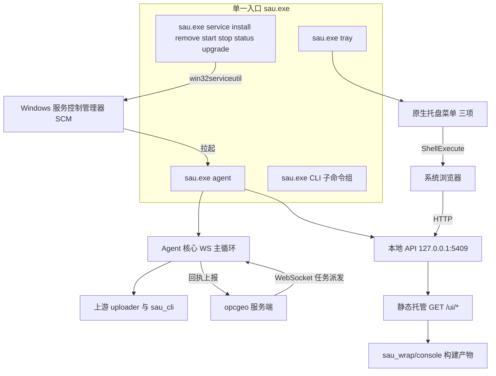
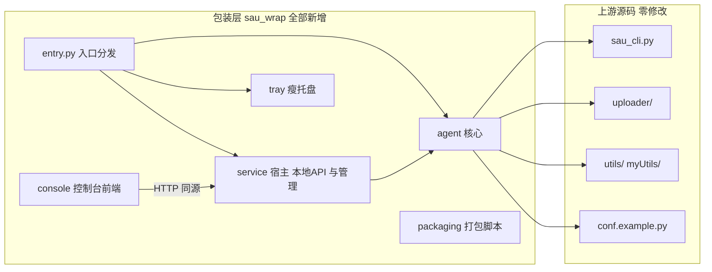
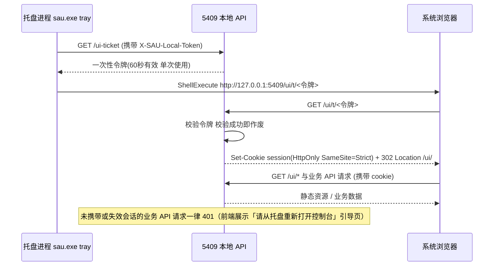
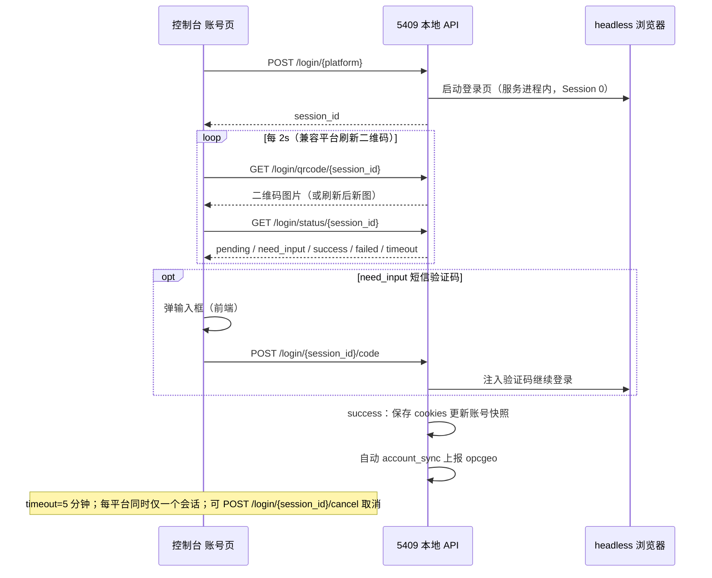
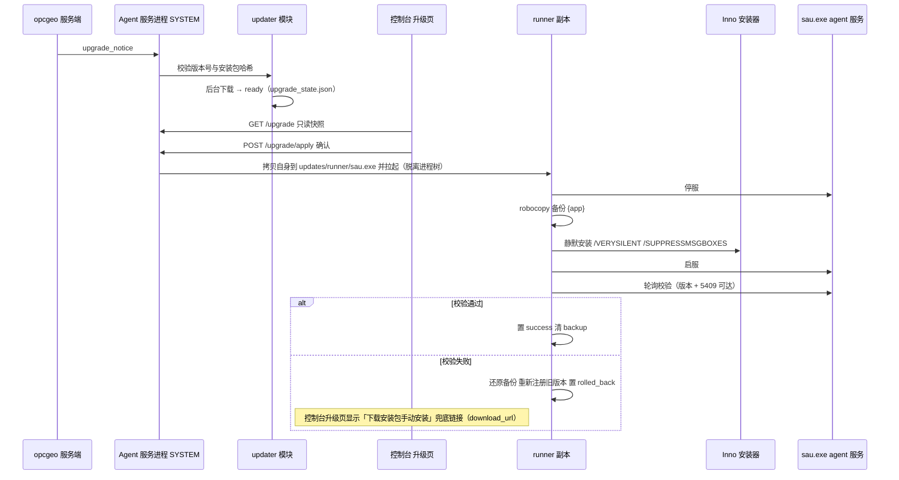

# SAU 客户端重建方案——单 EXE 与包装层设计

| 项目 | 内容 |
| --- | --- |
| 文档版本 | v1.3（修正验证复查发现的 7 处问题；落档打包体积优化与浏览器内核下载三层方案两项新定案） |
| 基线分支 | `tray_new`（= 上游 `main` @ `008e4ff`，git 已验证与 `origin/main` 完全一致） |
| 文档性质 | 方案讨论全过程实录 + 正式设计（以讨论结论为准） |
| 关联任务 | 任务 #5、任务 #7、任务 #9、任务 #11 |
| 状态 | 全部决策已定案（含冲突 1：包装层自建控制台；本地端口整合为 5409；旧 4-exe 从未发布，过渡链路取消） |

---

## 目录

1. [文档说明](#1-文档说明)
2. [讨论记录（全过程实录）](#2-讨论记录全过程实录)
3. [目标架构设计](#3-目标架构设计)
4. [服务安装与启动可靠性设计](#4-服务安装与启动可靠性设计)
5. [瘦托盘设计](#5-瘦托盘设计)
6. [Web 控制台设计](#6-web-控制台设计)
7. [打包与分发](#7-打包与分发)
8. [依赖与构建管理](#8-依赖与构建管理)
9. [上游同步与运维](#9-上游同步与运维)
10. [实施计划](#10-实施计划)
11. [决策记录表](#11-决策记录表)
13. [卸载设计](#13-卸载设计)
14. [日志与诊断](#14-日志与诊断)
15. [崩溃隔离与升级中断恢复](#15-崩溃隔离与升级中断恢复)
16. [测试策略](#16-测试策略)
17. [安装失败矩阵](#17-安装失败矩阵)
18. [风险与开放问题](#18-风险与开放问题)

> 注：§12 编号保留不用，以免决策表引用漂移。

---

## 1. 文档说明

### 1.1 目的

本文档解决 SAU（social-auto-upload）客户端的两大核心问题：

1. **打包与自启可靠性**：现状编译出 4 个 exe（sau / sau-ops / sau-service / sau-tray），打包难度大，且打完包后服务经常无法自动启动。
2. **托盘程序复杂度**：现有托盘程序（tkinter）GUI 复杂度高，多线程难以维护。

最终落地方向：**在 `tray_new` 分支上绿地重建**，以「单一 `sau.exe` 子命令分发 + 瘦托盘（原生菜单）+ 本地 Web 控制台」为目标架构，全程遵循「零修改包装」原则——不修改上游开源源码，仅在其上新增包装层，保证后续可无冲突地持续同步上游更新。

### 1.2 基线声明

- 工作区当前分支为 `tray_new`，HEAD = `008e4ff`（"Update GitHub Sponsors username in FUNDING.yml"）。
- git 已验证：`git rev-list --left-right --count tray_new...origin/main` 结果为 `0 0`，即 `tray_new` 与上游 `main` **完全一致**。
- 旧 `tray` 分支（含 `sau_agent_pkg/`、`sau_service/`、`sau_tray/`、`sau_ops.py`、`packaging/` 等 34 个新增文件及对上游文件的侵入式修改）**不作为代码基线**，仅作为踩坑经验参考，不复用任何代码。

### 1.3 术语

| 术语 | 含义 |
| --- | --- |
| 上游 / 上游源码 | 开源仓库 social-auto-upload 的 `main` 分支原有代码（uploader/、sau_cli.py、utils/、myUtils/ 等） |
| 包装层 | 本方案在 `tray_new` 上新增的独立目录（`sau_wrap/`），只 import 上游、不被上游 import |
| 单 EXE | 将原 4 个入口收敛为一个 `sau.exe`，按子命令分发（agent / service / tray / CLI 能力） |
| 瘦托盘 | 托盘程序仅保留原生系统托盘菜单（无 tkinter 复杂界面） |
| 本地 Web 控制台 | 由 5409 本地 API 静态托管的浏览器管理界面 |
| 5409 本地 API | Agent 服务进程在 `127.0.0.1:5409` 暴露的 HTTP 管理接口（源自 tray 分支 `sau_agent_pkg/local_api.py` 的设计；端口后经商讨由 5410 整合为 5409，见 4.4） |
| SCM | Windows 服务控制管理器（Service Control Manager） |
| 零修改包装 | 上游跟踪文件一律不改，所有能力通过新增文件实现，保证定期 merge 上游零冲突 |

### 1.4 与《SAU 对接详细设计文档》的关系

opcgeo 仓库 `docs/SAU对接详细设计文档.md` 定义了 opcgeo 服务端与 SAU 客户端之间的 WebSocket 协议、任务派发与回执语义。本文档**只涉及 SAU 客户端自身的重建**（入口收敛、托盘、控制台、打包、升级编排），**不在本文档范围内变更 opcgeo 侧的 WS 协议与服务端逻辑**。Agent 核心对 opcgeo 的 WS 对接行为沿用既有设计，仅在客户端侧重新组织承载它的进程形态与分发入口。

**与现状文档的取代关系映射表：**

| 现状文档章节 | 处置 |
| --- | --- |
| §1 说明、§2 整体方案、§3 WS 协议、§4 服务端、§8 数据库、§9 管理端、§11 部署配置 | 保留有效 |
| §5 客户端逻辑、§6 打包分发、§7 半自动升级（客户端侧） | 整体被本重建方案取代 |
| §10 平台映射、§12 已知限制 | 保留，客户端相关限制随重建更新 |

---

## 2. 讨论记录（全过程实录）

> 本章如实记录方案讨论全过程，用户原话以引用块（>）标注，备选方案与决策记录完整保留，未做删减。
>
> **编者注**：讨论发生时本地 API 端口记为 5410；后经用户确认，本地 API 端口统一整合为 **5409**（端口决策说明见 4.4，历史原话中的 5410 均按此理解）。

### 2.1 讨论起点：用户提出的两个问题（原话）

1. 编译成了 4 个 exe 文件，打包难度加大，sau_service 经常打完包后无法自动启动。
2. 现在的托盘程序页面，gui 复杂度高，多线程难以维护。

> 要求：基于现在的设计方案怎么改进？先讨论方案，不动代码。

### 2.2 背景约束（后续补充，原话）

> 「social-auto-upload 的代码应该参考 main 分支」

> 「我从 main 分支拉出一个新分支 tray_new 的分支，我希望 sau 的代码从这个新分支上重新开始，不要受 tray 分支代码的污染。」

（git 已验证：`tray_new` 与 `origin/main` 完全一致，`rev-list --left-right --count` 为 `0 0`。）

> 「并且你的方案要遵循一个原则：1. 现有代码是开源代码，一直在升级维护，2. 所以现在的方案是尽可能不要修改源代码，而是在源代码上进行包装，不要影响后续开源代码的升级。」

### 2.3 第一部分讨论：两大问题的根因分析与备选方案

#### 2.3.1 问题一根因

1. 4 个入口（sau / sau-ops / sau-service / sau-tray）= 4 次 Nuitka 编译，构建时间长、失败面大（仓库存在 `nuitka-crash-report.xml` 证据），任一入口编译异常都会污染最终安装包。
2. 服务自启失败的典型原因推断：
   - `post-install.bat` 自定义 CreateService 绕过 `pythonservice.exe`，ImagePath / 工作目录在升级替换场景可能失效；
   - `sau.iss` 的 PrepareToInstall「停旧服务→替换→注册→启动」串行步骤间服务控制管理器（SCM）状态未就绪就 start；
   - Session 0 下 asyncio + patchright 子进程冷启动慢，15 秒轮询 RUNNING 超时；
   - 杀软对新落盘 Nuitka 产物首跑扫描延迟。

#### 2.3.2 问题一备选方案（讨论原文）

**方案 A：单一入口 EXE + 子命令分发（推荐）。** 把 4 个入口收敛为 1 个 `sau.exe`，内部按子命令分发：

```
sau.exe service install|start|stop|upgrade   （吸收 sau-ops 的服务管理）
sau.exe agent                                （吸收 service_host 主逻辑，即服务进程本体）
sau.exe tray                                 （托盘）
sau.exe login|check|upload ...               （吸收 sau_cli）
```

Nuitka 只编一个 `--standalone` 目标；Windows 服务 ImagePath 指向 `sau.exe agent`；托盘启动项、开机自启、升级编排统一调同一 exe 不同子命令，升级时「替换自身目录」的自锁问题更容易统一处理（保留 `updates/runner/` 副本机制）。

**方案 B：服务托管交给 NSSM，彻底绕开自研服务安装。** `nssm install SAUAgentService sau.exe agent` + AppStdout / AppRestartDelay / AppThrottle；服务崩溃自动重启、日志落盘、启动延迟由 NSSM 负责，「打完包无法自启」问题约 80% 可消掉。代价：引入第三方组件、杀软偶有误报。

**方案 C：不换架构，只加固现有安装链路（最低成本）。** 注册后立即 `sc config ... start= delayed-auto failure= ... actions= restart/...`；启动改为「启动→轮询→失败读服务日志/事件日志→自动 retry 2 次」；PrepareToInstall 停服后等待文件句柄释放；托盘增加「服务存在但未运行→一键拉起」兜底。

**讨论结论：建议 A + C 组合，B 作为备选。**

#### 2.3.3 问题二备选方案（讨论原文）

**方案 D：瘦托盘 + 本地 Web 控制台（推荐）。** 托盘只保留原生菜单（启动/停止服务、打开控制台、平台登录、检查更新、退出），复杂界面迁到 5410 本地 API 托管的静态页，浏览器打开；UI 彻底脱离 Python 进程：没有 tkinter、没有多线程、升级时 UI 不会被文件替换锁死；遗留 `sau_frontend` 可改造复用。

**方案 E：保留 tkinter 但单线程化重构**（托盘菜单只触发动作、`after()` 轮询模型、禁止子线程碰 UI）。成本低但天花板低。

**方案 F：pywebview 重写。** 介于 D / E 之间，多一个依赖仍需打包进 Nuitka；5410 API 已存在，直接用系统浏览器（方案 D）更简单。

#### 2.3.4 第一轮用户决策记录

- 打包方案：选择「方案 A：单一 EXE 子命令（推荐）」。
- 托盘方案：用户自定义回答：

> 「A + 托盘只保留原生菜单：1. 启动/停止服务、2. 打开控制台(其它设置均在本地 web 控制台)」

> **编者注（任务 #11）**：托盘菜单最终定案为三项：打开控制台 / 打开日志目录 / 退出（无启停，见第 5 章与决策表行 18）；上述历史实录中的「启动/停止服务」菜单项已取消。

### 2.4 第二部分讨论：剩余设计点

#### 2.4.1 待讨论点 1：子命令结构与技术选型

建议结构：

```
sau.exe agent              # 服务进程本体（被 SCM 拉起，跑 WS 主循环 + 5410 API）
sau.exe service install|remove|start|stop|status|upgrade
sau.exe tray               # 托盘（开机自启指向这里）
sau.exe login|check|upload ...
sau.exe doctor|machine-code|bind ...
```

拍板点：

- CLI 框架建议 Typer 或 Click（4 个脚本合并后手写 argparse 维护成本放大）；
- pywin32 服务宿主惯例 `sau.exe agent --startup auto` 或 `service install` 内部调 `win32serviceutil.InstallService`，前者更符合惯例；
- `sau.exe tray` 需命名互斥量（Mutex）防多开。

#### 2.4.2 待讨论点 2：存量用户升级（最容易被忽略的风险）

> **编者注（任务 #9 定案）**：旧 4-exe 版本从未上线发布，本过渡链路已取消，正式设计以 §7.3 改写后版本为准；以下为历史实录原文。

线上装的是 4-exe 布局，服务 ImagePath 指向 `{app}\sau-service.exe`。升级时：

- AppId 保持不变覆盖升级；
- PrepareToInstall 从「停」升级为「停 + remove」；
- 旧托盘开机自启注册表项从 `sau-tray.exe` 改写为 `sau.exe tray`；
- 过渡逻辑写在新安装包的 `[Code]` 段，不依赖旧版卸载干净。

#### 2.4.3 待讨论点 3：本地 Web 控制台技术选型与鉴权

**3.1 选型：**

- 选项 a（推荐）：复用遗留 `sau_frontend`（Vue3 + Element Plus），baseURL 切到 5410，构建产物内嵌由 5410 托管 `GET /ui`；
- 选项 b：新写极简静态页。

5410 现有 9 端点覆盖状态 / 登录 / 账号 / 配置 / 升级，素材管理无对应端点；建议控制台第一期只做绑定 / 账号 / 升级，素材走 opcgeo-html 发布中心 OSS 直传。

**3.2 鉴权：**

- 选项 a（推荐）：托盘打开控制台时 `http://127.0.0.1:5410/ui/t/<一次性令牌>`，服务端校验后种 session cookie，令牌一次性短时效；
- 选项 b：回环地址同源免鉴权（简单但少一层纵深防御）。

> **编者注**：后经用户确认，本地 API 端口统一整合为 5409，控制台鉴权落地细节见 6.3。

#### 2.4.4 待讨论点 4：托盘最终形态

托盘感知服务状态：每 5-10 秒轮询 5410 `/status`，连不上判定未运行（唯一轻量轮询，可接受）。建议加「退出托盘」第三项（不影响服务运行）。

#### 2.4.5 待讨论点 5：实施节奏

建议分两期（一期单 EXE + 加固 + 托盘瘦身，二期 Web 控制台），也接受一次性全部完成。

#### 2.4.6 第二轮用户决策记录

- 控制台选型：选项 a：复用 sau_frontend（推荐）。
- 控制台鉴权：选项 a：一次性令牌 + cookie（推荐）。
- 实施节奏：一次性全部完成。
- 托盘形态：加退出托盘项（推荐），即最终三项：启动/停止服务、打开控制台、退出托盘。

> **编者注（任务 #11）**：托盘菜单最终定案为三项：打开控制台 / 打开日志目录 / 退出（无启停，见第 5 章与决策表行 18）；上述「启动/停止服务」项已取消。

### 2.5 第三部分讨论：Web 控制台打包方案

用户问：

> 「比如 web 控制台，也是要打包吧？用什么方案打包呢？」

推荐方案：**Vite 预构建静态产物 → 作为数据文件随 Nuitka 分发**：

1. **前端构建**：`cd sau_frontend && npm ci && vite build → dist/`（纯静态）。构建参数：`base './'` 或 `'/ui/'`；路由不用改（已用 `createWebHashHistory` hash 模式）；`VITE_API_BASE_URL` 置空，控制台与 5410 同源请求走相对路径，顺带解决旧版硬编码 `localhost:5409`。
2. **嵌入 Nuitka**：`packaging/nuitka_build.py` 加 `--include-data-dir=sau_frontend/dist=ui`（已有 `--include-data-files` 塞 `conf.py` 先例）；构建顺序上前端构建先行。
3. **Inno Setup 无感知**：`[Files]` 整目录递归释放，自动落到 `{app}\ui\`，安装脚本一行不改。
4. **运行时托管**：5410 加路由 `GET /ui/t/<一次性令牌>`（校验后种 cookie，302 到 `/ui/`）与 `GET /ui/*`（index.html no-cache，其余按 hash 长缓存）。托盘打开控制台 = `ShellExecute http://127.0.0.1:5410/ui/t/<token>`。

体积：Vite 产物（Vue3 + Element Plus 按需）约 1~2MB，相对 144MB 安装包可忽略。

不推荐备选：运行时从 OSS 下载（引入首启下载/版本对齐/离线降级）；`include-package-data` 打进 Python 包（拖慢 Nuitka 编译）。

构建机新要求：新增 Node.js 依赖；也可把前端构建做成独立 CI 步骤。

### 2.6 第四部分讨论：分支基线与「零修改包装」原则

#### 2.6.1 事实核查（git）

- `tray_new` 与 `origin/main` 完全一致（`008e4ff`，差异 `0 0`）；
- `tray` 分支独有 34 个新增文件（`sau_agent_pkg/`、`sau_service/`、`sau_tray/`、`sau_ops.py`、`packaging/` 等）；
- `main` 上完全没有与 opcgeo 对接的能力（grep `opcgeo` / `websockets` / `sau_agent` 零命中）；
- `tray` 分支还侵入式修改了上游共享文件（最典型：`myUtils/login.py` 引入 `from sau_agent_pkg.db_init import DB_PATH` 反向依赖、`requirements.txt` 全量重写、`pyproject.toml`、`utils/log.py`、`sau_backend.py` +550 行），违背包装原则且导致 `tray` 缺失 `main` 的 17 个上游修复（抖音短信验证码/显式声明、视频号 QR 适配等）；
- `main` 的 `requirements.txt` 是 UTF-16 编码。

#### 2.6.2 结论

改进方案从「改造现有代码」升级为「**在 `tray_new` 上绿地重建**」：直接一次设计到位目标架构（单 `sau.exe` 子命令 + 瘦托盘 + 本地 Web 控制台 + 半自动升级），`tray` 分支只作为踩坑经验参考，不复用任何代码。

#### 2.6.3 「零修改包装」原则下的代码分界

**上游源码（不可改动）：**

`uploader/`、`sau_cli.py`、`utils/`、`myUtils/`、`skills/`、`sau_backend.py`、`sau_frontend/`、`static/`、`requirements.txt`、`pyproject.toml`、`uv.lock`、`conf.example.py`

**包装层（全部新增目录，上游永远没有这些路径，定期 merge 上游 main 零冲突）：**

- 新增 `sau_wrap/`（服务宿主 + Agent 核心 + 本地 API + 托盘），通过 import 调用 `uploader/` / `sau_cli`，不编辑它们；
- 独立依赖清单与打包脚本，不动上游 `requirements.txt`；
- 控制台作为包装层自有前端新建。

#### 2.6.4 与既有决策的三个冲突点

**冲突 1：控制台复用 `sau_frontend` 会违反原则**——改 `sau_frontend/src/utils/request.js` 的 baseURL（现为 `import.meta.env.VITE_API_BASE_URL || 'http://localhost:5409'`）及 `.env.production` / `.env.development` 就是改上游源码。

- 选项 a（推荐）：控制台作为包装层全新自建（独立目录，零依赖上游前端），上游 `sau_frontend` 原样保留闲置；
- 选项 b：原样构建上游前端不改一行，但只能连上游 5409 旧后端，连不上 Agent 服务。

> **编者注**：冲突 1 已定案——用户确认采用选项 a（包装层自建，目录 `sau_wrap/console/`），不复用、不修改上游 `sau_frontend`；实现方案见第 6 章。

★ 用户对冲突 1 的回应是：

> 「没有明白，请进一步说明要修改哪些？」

**文档中必须给出的具体说明：** 若要复用上游 `sau_frontend` 连上我们的 5410 服务，至少需要修改这些上游跟踪文件：

1. `sau_frontend/src/utils/request.js` 中的 baseURL 默认值（硬编码 5409）；
2. `.env.production`（值为 `http://localhost:5409`）与 `.env.development`（`/api` 代理到 5409）；
3. 各 `api/*.js` 中面向 5409 旧接口的端点路径（`/getAccounts`、`/getFiles` 等）需全部改写为 5410 的新端点（`/status`、`/accounts/status`、`/login` 等）；
4. `vite.config.js` 的 devServer proxy。

这些全部是上游仓库跟踪的文件，每次上游更新合并都会产生冲突，违背零修改原则；而包装层自建控制台则只新增文件、永不触碰上游。文档应明确推荐选项 a，并标注该项为【待用户最终确认】。

> **编者注**：上述「待确认」状态已在任务 #7 中关闭——用户已确认采用选项 a（包装层自建），全文不再有待确认事项，定案实现见第 6 章。

**冲突 2：包装层额外依赖**（websockets、pystray、aiohttp 等）→ 用户已决策：独立包装层依赖清单（新增 `sau_wrap/requirements.txt`，打包时与上游依赖合并安装，不动上游 `requirements.txt`）。

**冲突 3：入口与 CLI 的关系** → 单 `sau.exe` 的 CLI 能力不重写，包装层子命令调用上游 `sau_cli.py` 既有命令（import 或 subprocess），上游 CLI 升级自动跟随。

**上游同步方式** → 用户已决策：同仓分支 + 定期 merge（`tray_new` 定期 merge/rebase 上游 `main`；包装层只新增独立目录不改上游文件，天然零冲突）。

---

## 3. 目标架构设计

### 3.1 总体架构图



要点：

- 进程形态只有三种：服务进程（`sau.exe agent`，Session 0）、托盘进程（`sau.exe tray`，用户会话）、临时 CLI 进程；
- 所有复杂 UI 都在浏览器中，Python 进程不再承载任何界面；
- 5409 既是管理 API 也是控制台静态资源宿主，控制台与 API 同源。

### 3.2 单一 sau.exe 子命令规格表

| 子命令 | 职责 | 替代旧入口 | 关键实现约定 |
| --- | --- | --- | --- |
| `sau.exe agent` | 服务进程本体：WS 主循环 + 5409 本地 API + 任务调度 | `sau-service.exe`（service_host） | pywin32 服务宿主惯例支持 `sau.exe agent --startup auto`；SCM ImagePath 指向本命令 |
| `sau.exe service install\|remove\|start\|stop\|status\|upgrade` | Windows 服务生命周期管理 | `sau-ops.exe` | install 内部调 `win32serviceutil.InstallService`，注册后立即 `sc config delayed-auto + failure restart` |
| `sau.exe tray` | 瘦托盘（原生菜单三项） | `sau-tray.exe` | 命名互斥量防多开；开机自启注册表项指向本命令 |
| `sau.exe login\|check\|upload` 等平台子命令 | 平台登录 / 检查 / 上传 CLI | `sau_cli.py` 直接执行 | 包装层转发调用上游 `sau_cli.py`（import 或 subprocess），不重写 |
| `sau.exe doctor\|machine-code\|bind ...` | 诊断 / 机器码 / 绑定 | sau-ops 附属能力 | 包装层自有实现 |
| `sau.exe browser install [--from-file <zip>]` | 下载 / 安装浏览器内核（支持从本地 zip 离线安装） | —（新增能力） | 包装层自有实现；三层下载方案见 8.7，安装时机见 7.3 |

> 说明：上游 `sau_cli.py` 现有命令结构为按平台分组的 argparse 子命令（`douyin` / `kuaishou` / `xiaohongshu` / `bilibili` / `tencent` / `youtube`，每个平台下 `login` / `cookie-auth` / `upload-video` / `upload-note` 等动作），包装层入口保持同构透传。

### 3.3 目录规划（sau_wrap/ 内部结构建议）

```
social-auto-upload/                 # 仓库根（= 上游源码，零修改）
├── uploader/  myUtils/  utils/  skills/  static/   # 上游，不动
├── sau_cli.py  sau_backend.py  conf.example.py     # 上游，不动
├── sau_frontend/                                   # 上游前端，原样保留闲置（冲突1选项a）
└── sau_wrap/                       # ★ 包装层：全部新增，上游永远没有此路径
    ├── __init__.py
    ├── entry.py                    # sau.exe 唯一入口：子命令分发（Typer/Click）
    ├── agent/                      # Agent 核心：WS 客户端、任务调度、账号管理
    │   ├── core.py
    │   ├── ws_client.py
    │   ├── dispatcher.py
    │   └── accounts.py
    ├── service/                    # 服务宿主 + 5409 本地 API（含静态托管/会话/登录会话管理）+ 服务管理（pywin32）；本地 API 并入本目录，不设独立 local_api/（与 6.5 对齐）
    │   ├── host.py                 # agent 命令的服务化封装（--startup auto 惯例）
    │   ├── ops.py                  # service install/remove/start/stop/status/upgrade
    │   ├── server.py               # 5409 本地 API（aiohttp）
    │   ├── routes.py               # 路由与处理器（含登录会话族、升级端点族）
    │   ├── ui_host.py              # GET /ui/t/<token>、GET /ui/*
    │   └── token.py                # 一次性令牌签发与校验、会话表
    ├── tray/                       # 瘦托盘（pystray，单线程 + 轻量轮询）
    │   └── tray_app.py
    ├── console/                    # ★ 控制台前端（包装层自建，Vue3+Vite，零依赖上游前端；v1.2 起统一命名 console，见 6.5）
    │   ├── src/
    │   ├── vite.config.js
    │   └── dist/                   # 构建产物（构建时生成，不入库）
    ├── upgrade/                    # 升级编排：runner 副本、备份、静默安装、回滚
    │   ├── orchestrator.py
    │   └── runner.py
    ├── packaging/                  # 打包脚本（Nuitka + Inno Setup）
    │   ├── nuitka_build.py
    │   ├── build_console.py        # 前端构建步骤
    │   └── sau.iss
    ├── requirements.txt            # 包装层独立依赖清单
    ├── conf.py                     # 包装层配置（由上游 conf.example.py 派生约定）
    └── version.py                  # APP_VERSION 版本单一事实源（可被 SAU_VERSION 环境变量覆盖，见 8.4）
```

### 3.4 包装层与上游的依赖方向图



**铁律：依赖方向只能是 包装层 → 上游（单向），严禁反向。** 上游任何文件不得 import 包装层符号（`tray` 分支 `myUtils/login.py` 反向 import `sau_agent_pkg` 是反例，见第 9 章教训清单）。

### 3.5 本地 API 端点清单（监听 5409）

下表为 tray 分支 `sau_agent_pkg/local_api.py` 的**现状端点参照**（以实际代码核对为准）；重建时按此清单在包装层 `service/` 模块重新实现，二者是「参照源」与「重建目标」的关系，并非直接复用代码。

| 方法 | 路径 | 职责 |
| --- | --- | --- |
| GET | `/status` | 服务状态（托盘轮询项） |
| POST | `/login` | 创建平台登录会话（v1.2 定案为会话式登录，见 6.5） |
| POST | `/accounts/recheck` | 账号状态复核 |
| GET | `/accounts/status` | 账号状态查询 |
| DELETE | `/accounts` | 账号删除 |
| POST | `/config` | 配置更新 |
| GET | `/config` | 配置读取 |
| POST | `/reload` | 配置热重载 |
| GET | `/upgrade` | 升级状态只读快照（v1.2 定案，确认/稍后见 7.4） |

重建时按此清单在包装层 `service/` 模块重新实现，并新增：`/ui-ticket`、`/ui/t/<token>`、`/ui/*` 静态托管（见第 6 章）、扫码登录会话族端点（见 6.5）、升级确认端点族（见 7.4）。素材管理无对应端点，第一期不做，素材走 opcgeo-html 发布中心 OSS 直传。

### 3.6 运行时数据布局与本地库设计（v1.2 定案）

运行时数据统一落在 `%ProgramData%\SAU\`（服务与托盘共享、跨用户会话可见）：

```
%ProgramData%\SAU\
├── config.json              # 绑定与运行配置（server_url、agent_token 指针、端口覆盖等）
├── credential.bin           # Agent 凭证（DPAPI LOCAL_MACHINE 级加密，见 14/6.3）
├── local_token.bin          # 本地 API 访问令牌（服务每次启动重新生成，users-full 权限）
├── cookies\
│   └── {platform}_{account}.json   # 各平台账号 cookies（原样承接现状布局）
├── db\
│   └── sau.db               # 本地 SQLite（WAL 模式）
├── logs\                    # 见第 14 章日志布局（%ProgramData%\SAU\logs）
├── downloads\
│   └── {task_id}\           # 任务素材下载工作目录（按任务隔离）
├── browsers\                # 浏览器内核（首启下载或离线安装，见 8.7）
└── updates\                 # 升级编排工作区（runner 副本、备份）
    └── etc\
        └── upgrade_state.json   # 升级状态机持久化（八态，见 3.8 与 7.4）
```

**本地 SQLite 表（仅两张）**：`local_tasks`（任务本地快照）与 `result_queue`（结果补发队列）；**不承接旧后端遗留表**（`user_info` / `file_records` 等随旧 `sau_backend.py` 一并弃用）。WAL 模式保证读写不互阻塞；`result_queue` 承担断线补发语义：执行结果先落队列，WS 在线时消费上报、断线时留存，恢复后自动补发，保证结果不丢。

**承接声明**：原样承接现状布局（现状文档 §5.9 运行时目录结构），存量升级时 cookies / 凭证无缝保留。

**写入设计原则**：「零修改 = 不改仓库文件」——指仓库跟踪文件零改动；**运行时内存级 monkey-patch（如改写 `conf.BASE_DIR` 指向上表数据目录）是合法包装手段**，不产生任何仓库文件变更。

**`local_token.bin`**：服务**每次启动重新生成**，写入 `%ProgramData%\SAU`（users-full 权限，托盘可读）；托盘 / CLI 读取后以 `X-SAU-Local-Token` 头调用本地 API；**控制台浏览器永不接触此令牌**（控制台一律走一次性令牌换 Cookie 链路，见 6.3）。

### 3.7 模块接口契约表（v1.2 定案）

| 调用方 | 被调方 | 通道 | 鉴权 | 用途 |
| --- | --- | --- | --- | --- |
| 托盘 | 服务 | HTTP 5409 | `X-SAU-Local-Token`（读 `local_token.bin`） | `/status` 状态感知 |
| 托盘 | 系统 | ShellExecute | 无需提权 | 打开控制台 / 打开日志目录 |
| 控制台 | 服务 | HTTP 5409 | Cookie 会话 + `X-Console-Nonce` | 全部页面操作 |
| CLI（sau.exe） | 上游模块 | 进程内 import | — | 包装上游 CLI 能力 |
| CLI | 服务 | HTTP 5409 | `X-SAU-Local-Token` | bind / status 等运维命令 |
| Agent | opcgeo | WSS 外连 | Agent token | 协议不变（现状文档 §3） |
| runner 副本 | 服务 / 安装器 | 进程控制 | SYSTEM 上下文 | 升级编排（见 7.4） |

### 3.8 可靠性语义保留清单（v1.2 定案：原样保留）

以下现状文档已定义的可靠性语义，在重建实现中**逐条原样保留**，不简化、不变更行为：

| # | 语义 | 现状文档出处 |
| --- | --- | --- |
| 1 | 时钟偏差校准：基于心跳 `server_time` 的滑动窗口 10 样本估计，偏差 > 5 分钟暂停调度 | §5.2（以代码为准） |
| 2 | 凭证存储：DPAPI **LOCAL_MACHINE** 级加密 | §5.8 |
| 3 | 日志脱敏规则（凭证 / cookie / 手机号等） | §5（以代码为准） |
| 4 | 升级状态机八态 + `upgrade_state.json` 持久化 | §7.3 |
| 5 | 离线/弱网可靠性：重连退避 2s→300s | §5.2（以代码为准） |
| 6 | `result_queue` 断线补发 | §5.4 |
| 7 | 凭证类关闭码 4401 / 4403 / 4409 / 4410：挂起零重连，等待凭证恢复 | §3.5、§5.2 |
| 8 | 素材下载错误分类（可重试 / 不可重试） | §5.3（以代码为准） |

---

## 4. 服务安装与启动可靠性设计

采用 **方案 A（单一 EXE）+ 方案 C（安装链路加固）** 组合落地；方案 B（NSSM）作为备选保留。

### 4.1 pywin32 服务宿主

- `sau.exe agent` 按 pywin32 服务惯例实现：`win32serviceutil.ServiceMain` 入口，支持 `--startup auto` 参数（SCM 启动时自动附加）；
- `sau.exe service install` 内部调用 `win32serviceutil.InstallService`，不再使用自定义 CreateService 绕过 `pythonservice.exe` 的做法（该做法是 tray 分支自启失败的根因之一：ImagePath / 工作目录在升级替换场景失效）；
- ImagePath 固定为 `"{app}\sau.exe" agent`，服务名建议沿用 `SAUAgentService`；
- 服务进程工作目录显式设置为 `{app}`，日志目录 `%ProgramData%\SAU\logs`（见 3.6 与第 14 章），避免 Session 0 下相对路径歧义。

### 4.2 服务启动策略加固（方案 C 落地项）

| 加固项 | 具体做法 |
| --- | --- |
| 延迟自启 | 注册后立即 `sc config SAUAgentService start= delayed-auto`，避开开机启动风暴 |
| 失败重启 | `sc config SAUAgentService failure= reset/86400 actions= restart/30000/restart/60000/restart/120000`（首次失败 30 秒后重启，梯度加长，24 小时重置计数） |
| 启动重试 | 启动后轮询状态（放宽至 30~60 秒，兼容 Session 0 下 asyncio + patchright 冷启动），失败则读服务日志 / Windows 事件日志后自动 retry 2 次 |
| 停服等待 | PrepareToInstall 停服后等待进程退出与文件句柄释放（轮询 `tasklist` / 重试文件操作），再执行文件替换 |
| 无人值守恢复 | v1.2 定案：不提供托盘手动启停（见第 5 章），服务恢复全靠延迟自启 + 故障自动重启（上两行），排障靠日志与 `doctor`（见第 14 章） |
| 日志落盘 | 服务进程 stdout/stderr 重定向至 `%ProgramData%\SAU\logs\service.log`，事件日志写入 Application 日志源 |

### 4.3 NSSM 备选说明（方案 B，不默认采用）

`nssm install SAUAgentService sau.exe agent` + AppStdout / AppRestartDelay / AppThrottle，可把崩溃自动重启、日志落盘、启动延迟全部托管给 NSSM，「打完包无法自启」问题约 80% 可消掉。**不默认采用的代价**：引入第三方组件、杀软偶有误报。若 4.2 加固后自启失败率仍不可接受，切换成本很低（只改安装脚本的服务注册段）。

### 4.4 端口决策说明（后经用户确认）

> **编者注**：讨论阶段本地 API 端口曾记为 5410，后经用户确认统一整合为 5409，本节为正式决策记录；第 2 章讨论记录为历史实录，其中 5410 表述保留原貌。

- **单端口**：新服务（单一 `sau.exe agent`）的本地 API 与控制台静态托管统一监听 `127.0.0.1:5409`，全系统仅一个本地端口；
- **上游遗留后端弃用**：上游 `sau_backend.py`（Flask 5409）正式标记**弃用**，不得与新服务并行启动；Windows 安装形态不启动旧后端，Docker 为独立环境；
- **可配置**：端口为可配置项（`config.json` 可覆盖），防止特殊环境撞端口；
- **绑定失败必须明确报错**：服务启动绑定 5409 失败时必须输出明确报错（提示「5409 被上游遗留 sau_backend.py 或其他进程占用」），**禁止静默失败**。

**选择 5409 的理由**：本地只留一个端口的概念最简；与上游遗留后端端口关系明确（占用 + 弃用声明）；冲突风险低（Windows 安装形态不启动旧后端，Docker 为独立环境）。

---

## 5. 瘦托盘设计（v1.2 定案：无手动启停，三菜单）

> **编者注（任务 #9 定案）**：服务不提供托盘手动启停（方案 C 收敛形态）——服务只靠开机延迟自启 + 故障自动重启（见 4.2），排障靠日志（菜单项 2）与 `doctor`（见第 14 章）；讨论阶段的「启动/停止服务」菜单项已删除。

### 5.1 三项菜单规格（v1.2 定案）

| 序号 | 菜单项 | 行为 |
| --- | --- | --- |
| 1 | 打开控制台 | 生成一次性令牌后 `ShellExecute http://127.0.0.1:5409/ui/t/<token>` |
| 2 | 打开日志目录 | `ShellExecute` 打开 `%ProgramData%\SAU\logs`（排障入口） |
| 3 | 退出 | 仅退出托盘进程，**不影响服务运行** |

（平台登录、配置、升级等其余一切设置均在本地 Web 控制台完成，托盘不承载。）

### 5.2 状态感知与图标状态（v1.2 定案）

- 每 5~10 秒轮询 `http://127.0.0.1:5409/status`，连不上判定「服务离线」；这是托盘进程**唯一**的轻量轮询；
- 图标状态区分：服务在线 / 服务离线；
- 服务停止时气泡提示：「服务未运行，系统会自动恢复」（对应延迟自启 + 故障自动重启策略，见 4.2）；
- 托盘基于 pystray 原生菜单，单进程单线程事件模型，无 tkinter、无多线程碰 UI。

### 5.3 Mutex 单实例

启动时创建命名互斥量（如 `Global\SAUTrayMutex`），已存在则直接退出，防止多开重复托盘图标。

### 5.4 开机自启注册表

- 位置：`HKCU\Software\Microsoft\Windows\CurrentVersion\Run`，键名 `SAUTray`；
- 值：`"{app}\sau.exe" tray`；
- 由安装包在**首次安装**时写入（Inno `[Registry]` 或 `[Code]` 段），无需处理旧值改写（旧 4-exe 从未发布，过渡链路已取消，见 7.3）。

---

## 6. Web 控制台设计（包装层自建实现方案，冲突 1 【已定案】）

### 6.1 定位与技术选型（冲突 1 已定案：包装层自建）

冲突 1 经用户确认**已定案**：控制台作为包装层全新自建（选项 a），不复用、不修改上游 `sau_frontend`。定案依据：若复用上游前端，必须修改 4 类上游跟踪文件（`request.js` baseURL 硬编码、两个 `.env` 文件、`api/*.js` 旧端点、`vite.config.js` devServer proxy），每次上游合并必冲突，违背零修改原则（完整清单见 2.6.4）。

- **位置**：`sau_wrap/console/`（包装层新增目录，上游永远没有此路径，零冲突）；
- **技术栈**：Vue 3 + Vite + 轻量 UI 库（Element Plus 或 naive-ui）+ hash 路由（`createWebHashHistory`，静态托管无需服务端路由回退）；
- **原则**：只做「5409 本地 API 的浏览器皮肤」——所有状态与操作经 HTTP 调用包装层服务，前端无本地逻辑，关浏览器不影响运行中任务。

### 6.2 第一期页面范围（三页 + 状态总览）

| 页面 | 端点（5409） | 功能 |
| --- | --- | --- |
| 状态总览（首页） | `GET /status` | ws 连接状态、版本、在线账号数、活跃任务数、token 到期时间与状态、上次断开原因 |
| 绑定页 | `GET/POST /config`、`POST /reload` | 展示机器码；粘贴 Server URL + Token → 保存 → 热重载；显示绑定结果 |
| 账号页 | `GET /accounts/status`、登录会话族（见 6.5）、`POST /accounts/recheck`、`DELETE /accounts` | 各平台账号列表（有效/过期/未验证）、发起扫码登录、复检、删除 |
| 升级页 | `GET /upgrade`、`POST /upgrade/apply`、`POST /upgrade/snooze`（见 7.4） | 升级状态机展示、确认升级/稍后提醒 |

素材管理不在第一期（走 opcgeo-html 发布中心 OSS 直传）。

### 6.3 鉴权实现（一次性令牌 + Cookie）

链路：托盘（持 `X-SAU-Local-Token`）→ `GET /ui-ticket` 获取一次性令牌（60 秒有效、单次使用）→ `ShellExecute http://127.0.0.1:5409/ui/t/<令牌>` → 服务端校验、`Set-Cookie`（`HttpOnly`、`SameSite=Strict`）、302 到 `/ui/` → 后续同源请求带 Cookie；401 时显示「请从托盘重新打开控制台」引导页。

- 静态资源 `/ui/*` 可公开（仅 `127.0.0.1`），所有业务 API 强制校验 Cookie 会话；
- 原 `X-SAU-Local-Token` 头机制保留，供托盘 / CLI 本地调用，两套鉴权并存。



安全要点：令牌一次性消费、有效期 60 秒；5409 仅绑定 `127.0.0.1`（可按 4.4 配置化覆盖）。

安全细节补齐（v1.2 定案）：

- **Agent 凭证**：`credential.bin`，DPAPI **LOCAL_MACHINE** 级加密（存于 `%ProgramData%\SAU`，见 3.6）；
- **一次性令牌**：`secrets.token_urlsafe(32)` 生成；服务端内存表（令牌→过期时间），单次核销即删，60 秒过期；
- **会话策略**：单实例顶替（新开控制台顶掉旧会话），30 分钟无活动自动失效；
- **CSRF 防护**：Cookie `SameSite=Strict` + 写操作（`/config`、`/upgrade/apply`、登录/删除账号等）需携带从页面注入的随机 `X-Console-Nonce` 头；
- **401 统一拦截**：前端拦截 401 → 跳转引导页「会话已失效，请从托盘重新打开控制台」，**禁止失效态发起写操作**。

### 6.4 服务端（包装层）新增能力（v1.2 定案）

1. **静态托管路由**：`GET /ui/*` 从安装目录 `ui/` 读文件，`index.html` no-cache、hash 资源长缓存；
2. **会话管理**：一次性令牌签发 / 核销 + 内存会话表（单实例顶替、30 分钟无活动失效，服务重启会话失效可接受）；
3. **登录会话族端点**：原触发式 `POST /login` 升级为会话式（`POST /login/{platform}`、`GET /login/qrcode/{session_id}`、`GET /login/status/{session_id}`、`POST /login/{session_id}/code`、`POST /login/{session_id}/cancel`），完整链路见 6.5；
4. **升级端点族**：见 7.4（只读快照 + 确认 + 稍后）。

### 6.5 扫码登录完整链路（v1.2 定案）

**登录会话模型**：

| 端点 | 职责 |
| --- | --- |
| `POST /login/{platform}` | 创建登录会话；服务内启动 headless 浏览器 |
| `GET /login/qrcode/{session_id}` | 返回二维码图片（前端每 2s 轮询，兼容平台二维码刷新） |
| `GET /login/status/{session_id}` | 返回 `pending` \| `success` \| `failed` \| `timeout` \| `cancelled` \| `need_input` |
| `POST /login/{session_id}/code` | 提交短信验证码（`need_input` 时，前端弹输入框） |
| `POST /login/{session_id}/cancel` | 取消会话（关浏览器、释放资源） |

规则：进度通道用**轮询**（非 SSE）；会话总超时 5 分钟（置 `timeout`）；每平台同时仅一个登录会话；登录跑在**服务进程内**（headless，Session 0）。成功后：服务保存 cookies → 更新账号快照 → 自动 `account_sync` 上报。`need_input` 短信验证码：前端弹输入框 → `POST /login/{session_id}/code` 提交。

> 能力增强声明：这是对现状的能力增强——旧 tkinter 托盘未解决短信验证码（`need_input`）交互，控制台化后由网页输入框补齐。



### 6.6 工程结构

```
sau_wrap/
├── console/                 # 控制台前端源码（新增）
│   ├── src/{views,api,router}/
│   ├── vite.config.js       # base:'./' + hash路由 + dev proxy
│   └── dist/                # 构建产物（.gitignore）
├── agent/                   # WS Agent 核心
├── service/                 # 服务宿主 + 5409 本地 API（含静态托管/会话/登录会话管理）
├── tray/                    # 瘦托盘
└── packaging/               # Nuitka + Inno Setup
```

> 注：本地 API 不设独立 `local_api/` 目录，并入 `service/`（与 3.3 目录树对齐）。

### 6.7 构建与分发链路

1. `cd sau_wrap/console && npm ci && vite build` → `dist/`（约 1~2MB）；
2. Nuitka：`--include-data-dir=sau_wrap/console/dist=ui`；
3. Inno Setup 整目录透传 → `{app}\ui\`（脚本零改动）；
4. 运行时 5409 托管，托盘「打开控制台」一步直达。

### 6.8 开发体验

`vite dev`（5173）+ devServer proxy 转发 API 到 `127.0.0.1:5409` 并注入会话头；代理配置在包装层自己的文件（`sau_wrap/console/vite.config.js`）里，不碰上游。

### 6.9 与上游的边界

上游 `sau_frontend/`、`sau_backend.py` 原样保留、完全闲置（标记遗留弃用）；控制台只依赖包装层 5409 API，与上游代码零耦合，上游升级永远不影响控制台。

---

## 7. 打包与分发

### 7.1 Nuitka 单目标

- 只编译**一个** `--standalone` 目标：`sau_wrap/entry.py → sau.exe`（吸收原 4 个入口的全部职责）；
- 消除 4 次编译的时间成本与失败面（tray 分支曾出现 `nuitka-crash-report.xml`）；
- 数据文件：`--include-data-dir=sau_wrap/console/dist=ui`（沿用 `--include-data-files` 塞 `conf.py` 的既有先例模式）；
- 平台自动化依赖（patchright/浏览器内核等）沿用 tray 分支打包经验，随安装包分发。

### 7.2 打包链路图

```mermaid
graph LR
    A1[sau_wrap/console npm ci] --> A2[vite build 产出 dist/]
    B1[上游 requirements.txt UTF-16 解码读取] --> C1[合并依赖安装]
    B2[sau_wrap/requirements.txt] --> C1
    A2 --> D[Nuitka --standalone 编译 sau_wrap/entry.py]
    C1 --> D
    D --> E[sau.exe + ui/ + 运行时数据]
    E --> F[Inno Setup sau.iss]
    F --> G[安装包 sau-{version}.exe]
```

构建顺序：**前端构建先行 → 依赖合并安装 → Nuitka 编译 → Inno Setup 打包**（见第 8 章）。

### 7.3 Inno Setup 安装包方案（首次安装 + 新布局自身覆盖升级）

> **编者注（任务 #9 定案）**：旧 4-exe 版本从未上线发布，原「过渡升级三步骤」（停+remove 旧服务、清理旧入口、改写自启注册表）已整体删除；本节只覆盖两个场景——**干净机器首次安装**与**新布局自身版本间覆盖升级**。

- `[Files]` 整目录递归释放，`ui/` 自动落到 `{app}\ui\`，安装脚本无感知；
- **AppId 保持不变**：支撑新布局后续版本间覆盖升级（配合 7.4 静默 `/VERYSILENT` 安装）；
- **首装流程**（`[Code]` / `[Run]` 段）：
  1. 文件释放：`{app}` 整目录（含 `sau.exe`、`ui/` 等）；
  2. 创建 `%ProgramData%\SAU`（`{commonappdata}\SAU`）运行时数据目录结构（见 3.6）并设置 **users-full 权限**（托盘与用户会话进程可读写）；
  3. 写开机自启注册表：`HKCU\Software\Microsoft\Windows\CurrentVersion\Run`，键名 `SAUTray`，值 `"{app}\sau.exe" tray`（见 5.4）；
  4. `sau.exe service install`：注册服务并立即配置 `delayed-auto` + `failure restart`（见 4.2）；
  5. 启动服务并轮询校验（30~60 秒窗口，失败按 17 章矩阵处理）；
  6. 完成页提示。
- **浏览器内核下载时机（v1.3 定案）**：**不在安装器内下载**，保持安装轻量；服务首启按需触发下载，托盘 / 控制台引导（下载方案见 8.7；下载失败不阻断安装，见 §17 阶段 5）。
- **覆盖升级说明**：覆盖升级场景仍需停服 + 等待进程退出与文件句柄释放（PrepareToInstall，见 4.2）；首次安装无存量服务，不涉及该步骤。
- **防御性说明（一行）**：若检测到残留旧服务名 `SAUAgentService` 指向非 `sau.exe` 的 ImagePath，先 remove 再重装。

### 7.4 升级编排与端到端链路（v1.2 定案）

**端点语义**：

| 端点 | 语义 |
| --- | --- |
| `GET /upgrade` | 只读快照：状态机阶段（八态，见 3.8）、目标版本、下载进度、校验结果 |
| `POST /upgrade/apply` | 确认执行升级（控制台升级页唯一确认入口） |
| `POST /upgrade/snooze` | 稍后提醒 |

**编排主体**：升级编排由**服务进程（SYSTEM 上下文）直接发起**，无 UAC 弹窗；**控制台是唯一确认入口**——托盘菜单已砍掉升级确认入口（见第 5 章）。

**端到端链路（10 步）**：

1. opcgeo 下发 `upgrade_notice`；
2. updater 校验（版本号比较 + 安装包哈希校验）；
3. 后台下载安装包；
4. 状态机置 `ready`，控制台升级页可见；
5. 控制台确认（`POST /upgrade/apply`）；
6. 服务拷贝自身到 `updates/runner/sau.exe`；
7. 拉起 runner 副本（脱离服务进程树，避开「替换自身目录」自锁）；
8. runner：停服 → robocopy 备份当前 `{app}` → Inno 静默安装（`/VERYSILENT /SUPPRESSMSGBOXES`）；
9. 启服 → 轮询校验（版本与 5409 可达性）；
10. 校验失败自动回滚（还原备份、重新注册旧版本），置 `rolled_back`。

**兜底**：若 SYSTEM 编排安装失败且回滚已完成，控制台升级页提供「下载安装包手动安装」链接（直链 `download_url`），由用户自行执行安装。

状态机持久化于 `upgrade_state.json`（八态，见 3.8）；中断恢复见第 15 章。



### 7.5 Nuitka 打包参数基线（v1.2 定案）

**直接移植基线清单**（沿用 tray 分支已验证经验）：

- `--jobs≤4`：限制并行编译作业数，规避构建机内存峰值崩溃；
- 禁用 ccache：`CCACHE_DISABLE=1` + 缓存读写关闭，避免缓存污染导致产物不可复现；
- 显式 `--include-package` 声明懒加载包（平台 uploader 等动态 import 模块，Nuitka 静态分析不可达）；
- patchright driver 单份拷贝（去重多浏览器架构重复文件）；
- 构建后清理 `*.build` 中间目录。

**两个新课题（实施验证点，保留在风险清单见第 18 章）**：

1. **多入口合并编译**：Nuitka `--python-flag=multi_dist` 或多 `--main` 方案验证；回退方案 = 单 main（`entry.py`）+ 子命令模块导入分发器（本方案默认形态，天然单入口）；
2. **控制台窗口策略**：`agent` / `tray` 子命令用 `--windows-console-mode=disable` 隐藏黑窗；用户在终端敲 `sau.exe login ...` 时 stdout 挂调用方终端；异常时 `AllocConsole` 兜底弹出控制台以便排障。

---

## 8. 依赖与构建管理

### 8.1 依赖清单策略（冲突 2 已决策）

- 新增 `sau_wrap/requirements.txt`：包装层专属依赖（如 `websockets`、`pystray`、`aiohttp`、`pywin32`、`Typer/Click` 等）；
- 上游 `requirements.txt` **不动**（注意其为 UTF-16 编码，构建脚本读取时必须显式解码，见 9.4）；
- 打包/安装时将两份清单合并安装到同一运行环境；
- 上游开源升级合并时，依赖清单零冲突。

### 8.2 构建机要求

- 新增 **Node.js** 依赖（供 `sau_wrap/console` 的 `npm ci && vite build`）；
- 其余沿用既有：Python、Nuitka、MinGW（如既有 `packaging/dl_mingw.py` 流程）、Inno Setup 编译器；
- 可选：把前端构建做成独立 CI 步骤，产物以数据文件传入 Nuitka 步骤。

### 8.3 构建顺序

1. `sau_wrap/console`：`npm ci` → `vite build`（`base: '/ui/'` 或 `'./'`，路由用 hash 模式免服务端路由改造；API 走同源相对路径）；
2. 合并依赖安装（上游 `requirements.txt` UTF-16 解码 + `sau_wrap/requirements.txt`）；
3. Nuitka 编译 `sau_wrap/entry.py` → `sau.exe`，`--include-data-dir=sau_wrap/console/dist=ui`；
4. Inno Setup 打包 → 安装包 `sau-{version}.exe`。

### 8.4 版本管理（v1.2 定案）

- **版本单一事实源**：`sau_wrap/version.py` 的 `APP_VERSION`（可被 `SAU_VERSION` 环境变量覆盖）；**不回退读上游 `pyproject.toml`**——上游版本号与发布节奏独立，不得混用；
- **版本纪律（硬约束，终审修复⑨补入）**：正式发布版本禁带预发布后缀（`SAU_VERSION=x.y.z` 纯三段）；开发基线可用 `a/b/rc` 后缀（如 2.0.0a0）；
- **安装包命名**：维持 `sau-{version}.exe`（服务端 `download_url` 与客户端落盘命名一致，升级校验按此对账）；
- **AppId 延续**：Inno AppId 固定不变，支撑后续版本间覆盖升级（见 7.3）。

### 8.5 构建环境版本矩阵与产物校验（v1.2 定案）

**构建环境版本矩阵**（锁定，不得漂移）：

| 工具 | 版本基线 |
| --- | --- |
| Python | 锁定具体版本（随构建机现状首次固化，写入发布单） |
| Nuitka | 锁定具体版本 |
| MinGW | 锁定具体版本（沿用 `dl_mingw.py` 流程） |
| Node.js | 锁定具体 LTS 版本（供 `sau_wrap/console` 构建） |
| Inno Setup | 锁定具体版本 |

**产物哈希发布闭环**：

1. 构建脚本自动计算安装包 **SHA-256**（64 位小写 hex）；
2. 输出发布单：版本号 / 安装包路径 / sha256 / 构建时间 / 构建机；
3. 运营按发布单上传安装包到 HTTPS 白名单存储；
4. 管理端 `PUT /sau/upgrade-config` 填写三字段（版本号 / download_url / sha256）；
5. 保存即广播 `upgrade_notice`。

哈希由构建脚本产出，**运营只搬运、不手填哈希**，杜绝人工誊抄错误。

**代码签名**：待定——首发无签名，需安装时用户确认杀软白名单；签名证书落地后再评估接入。

### 8.6 打包体积优化（v1.3 定案）

**手段清单**：

| # | 手段 | 预期收益 | 风险 / 代价 |
| --- | --- | --- | --- |
| ① | 单目标去重（已设计，见 7.1） | 相对多入口省 30~40% | 无 |
| ② | Nuitka `--nofollow-import-to` 排除未用模块（测试框架、旧 xhs_uploader 遗留、未启用平台） | 10~20MB | 需维护排除清单，上游新增依赖时注意 |
| ③ | 剥离调试符号 + 包装层依赖裁剪 | 5~10MB | 无 |
| ④ | 浏览器内核不随包、运行时下载（已设计，见 7.3 与 8.7） | 省约 170MB | 依赖浏览器下载方案可靠性（见 8.7） |
| ⑤ | Inno Setup LZMA2 ultra（已设计） | 已生效 | 无 |
| ⑥ | UPX 压缩 | 再省 10~20% | **不采用**：杀软误报率显著上升，与首发无签名叠加风险大 |

**体积目标**：安装包 **≤100MB（不含浏览器内核）**，写入 16.1 打包冒烟清单作为验收项。

**二期可选实验项**：若确认所有平台发布与登录均可 headless，可只下载 chromium-headless-shell（约 80~90MB，比完整 Chromium 约 170MB 小一半）；需逐平台实测反检测兼容性，不阻塞一期。

### 8.7 浏览器内核下载三层方案（v1.3 定案）

**根因**：patchright/playwright 默认从微软 CDN（azureedge.net）下载内核，国内网络常缓慢或中途挂起（「卡着」不报错，体验最差）。

**三层设计**：

1. **镜像源策略**：下载默认设置 `PLAYWRIGHT_DOWNLOAD_HOST` 指向 npmmirror 国内镜像（tray 分支已验证可用），官方源作回退；
2. **下载可靠性**：显示进度百分比与速度；60 秒无字节进展判定卡死 → 自动断开重试 → 镜像源间切换（镜像→官方→镜像轮换，最多 3 轮）；支持重新发起；
3. **离线兜底**：提供手动安装入口——用户从任意渠道下载内核 zip，放入 `%ProgramData%\SAU\browsers\`，执行 `sau.exe browser install --from-file <zip>` 本地解压安装；覆盖公司内网 / 无外网环境。

与 §17 安装失败矩阵阶段 5（浏览器内核下载失败不阻断安装）呼应；该命令定义已落到 3.2 子命令规格表，安装时机见 7.3（首启按需触发，不在安装器内下载）。

---

## 9. 上游同步与运维

### 9.1 定期 merge 流程（已决策：同仓分支 + 定期 merge）

1. 上游开源仓库发版或定期巡检时，执行 `git fetch upstream && git merge upstream/main`（或按需 rebase）；
2. 由于包装层只新增 `sau_wrap/` 等独立目录、不改任何上游跟踪文件，**正常情况下合并零冲突**；
3. 合并后跑冒烟验证：`sau.exe login/check/upload` 透传上游 `sau_cli.py` 的能力回归（上游 CLI 升级自动跟随，包装层不重写）；平台自动化脚本（uploader/）行为回归；
4. 若上游变更了包装层 import 的符号（如 `uploader.*` 导出变化），仅在 `sau_wrap/` 内适配，仍不触碰上游文件。

### 9.2 零冲突保证

- 上游永远没有 `sau_wrap/` 路径 → 新增目录天然不冲突；
- 上游跟踪文件零改动 → 无内容冲突源；
- 上游 `sau_frontend/` 原样保留闲置（冲突 1 已定案：包装层自建控制台，见第 6 章）→ 前端也零冲突。

### 9.3 冲突 1 若反转为复用上游前端时的手工处理预案（已定案包装层自建，本预案仅作留档、不启用）

冲突 1 已定案为包装层自建（`sau_wrap/console/`），上游 `sau_frontend` 永远不碰，本预案**正常情况下不启用**；仅留档备查：若未来反转为复用上游 `sau_frontend`，则每次上游合并时需在合并后手工重新应用以下 4 类修改，并跑前端构建回归：

1. `sau_frontend/src/utils/request.js` baseURL 默认值改回 5409 同源相对路径；
2. `.env.production` / `.env.development` 的 `VITE_API_BASE_URL` 改回新服务侧配置；
3. `sau_frontend/src/api/*.js` 端点路径重新对齐包装层本地 API（`/getAccounts`→`/accounts/status` 等）；
4. `sau_frontend/vite.config.js` devServer proxy 目标改回。

该预案维护成本随上游迭代线性增长，这正是定案时选择包装层自建的核心原因。

### 9.4 UTF-16 requirements.txt 注意事项

`main` 分支的 `requirements.txt` 是 **UTF-16 编码**：

- 构建脚本读取时必须显式指定 `encoding='utf-16'`（或自动探测），否则按 UTF-8 解析会产生乱码依赖名导致安装失败；
- 合并依赖安装与 Nuitka 依赖分析均受此影响，打包脚本需统一封装读取函数；
- 禁止「顺手转码为 UTF-8」——那属于修改上游跟踪文件，违背零修改原则。

### 9.5 tray 分支教训清单（仅作经验，不复用代码）

| # | 教训 | 后果 | 本方案对策 |
| --- | --- | --- | --- |
| 1 | `myUtils/login.py` 引入 `from sau_agent_pkg.db_init import DB_PATH` **反向依赖**（上游文件 import 包装层） | 违反包装原则，上游合并必冲突 | 依赖方向铁律：只允许 包装层→上游（见 3.4） |
| 2 | `requirements.txt` 全量重写、`pyproject.toml` / `utils/log.py` / `sau_backend.py`（+550 行）侵入式修改 | 与上游持续分叉，缺失 main 的 17 个上游修复（抖音短信验证码/显式声明、视频号 QR 适配等） | 上游文件零修改；包装层依赖走独立 `sau_wrap/requirements.txt` |
| 3 | 4 个入口 4 次 Nuitka 编译 | 构建时间长、失败面大（出现 `nuitka-crash-report.xml`） | 单一 `sau.exe` 一次编译 |
| 4 | `post-install.bat` 自定义 CreateService 绕过 `pythonservice.exe` | 升级替换场景 ImagePath/工作目录失效，服务无法自启 | `win32serviceutil.InstallService` 标准路径 + 4.2 加固 |
| 5 | PrepareToInstall 停服后不等待 SCM/文件句柄就绪即继续 | 替换/启动时序竞态 | 停服等待 + 启动重试（4.2） |
| 6 | tkinter 托盘多线程碰 UI | GUI 复杂、难维护、升级时窗口被文件锁死 | 瘦托盘（pystray）+ Web 控制台，UI 脱离 Python 进程 |

---

## 10. 实施计划（一次性全部完成）

实施节奏已决策为**一次性全部完成**，按依赖关系排序如下：

| 步骤 | 内容 | 依赖 | 验收要点 |
| --- | --- | --- | --- |
| S1 | 搭建 `sau_wrap/` 骨架与 `entry.py` 子命令分发（Typer/Click） | 无 | `sau.exe --help` 列出全部子命令组；互斥量/日志初始化就绪 |
| S2 | Agent 核心移植重写（`agent/`）：WS 客户端、任务调度、账号管理，import 上游 `uploader` | S1 | 开发模式直跑 `sau.exe agent`，WS 可连 opcgeo、能派发一个上传任务 |
| S3 | 5409 本地 API（并入 `service/`）：9 个既有端点 + `/ui-ticket` + `/ui/t/<token>` + `/ui/*` 静态托管 + 令牌/cookie 鉴权 + 登录会话族端点（见 6.5） | S2 | 端点逐一 curl 通过；未带 cookie 请求被拒；绑端口失败明确报错（4.4） |
| S4 | 服务宿主与管理（`service/`）：pywin32 宿主（`--startup auto`）、install/remove/start/stop/status/upgrade、delayed-auto 与 failure restart | S2 | 干净环境 `service install` 后重启系统，服务自动拉起且 5409 可达 |
| S5 | 瘦托盘（`tray/`）：三项菜单（无启停）、/status 轮询、Mutex 单实例、开机自启注册表写入 | S3、S4 | 双开托盘仅存一份；三菜单行为正确；「打开控制台」走令牌链路 |
| S6 | 控制台前端（`sau_wrap/console/`）：状态总览/绑定/账号/升级四页，hash 路由，同源相对路径请求 | S3 | `vite build` 产物经 `/ui/*` 托管可完整操作四页 |
| S7 | 升级编排（`upgrade/`）：runner 副本、备份、静默安装、回滚，对接升级端点族（见 7.4） | S4 | 模拟旧版本→新版本升级全链路成功；失败注入可回滚 |
| S8 | 打包链路（`packaging/`）：前端构建→合并依赖→Nuitka 单目标→Inno Setup | S1~S7 | 干净机器首次安装成功、服务自启；新布局自身覆盖升级成功 |
| S9 | 首装与覆盖升级验证与发布 | S8 | 按 §7.3 首装/覆盖升级要点逐项验证；自启成功率达标（见 16.2 量化指标） |

---

## 11. 决策记录表（AskUserQuestion 全程）

| # | 时间序 | 问题 | 备选项 | 用户选择 | 备注 |
| --- | --- | --- | --- | --- | --- |
| 1 | 第一轮 | 打包方案选哪个？ | A 单一 EXE 子命令（推荐）；B NSSM 托管；C 仅加固现有链路 | **方案 A：单一 EXE 子命令（推荐）** | 最终落地为 A + C 组合，B 备选 |
| 2 | 第一轮 | 托盘方案选哪个？ | D 瘦托盘+Web 控制台（推荐）；E tkinter 单线程化；F pywebview | 用户自定义回答：「A + 托盘只保留原生菜单：1. 启动/停止服务、2. 打开控制台(其它设置均在本地 web 控制台)」 | 即方案 D 方向，菜单进一步收敛；已被行 18 定案覆盖 |
| 3 | 第二轮 | 控制台选型 | 选项 a 复用 sau_frontend（推荐）；选项 b 新写极简静态页 | **选项 a：复用 sau_frontend（推荐）** | 后因第四部分「零修改包装」原则产生冲突 1，重新评估 |
| 4 | 第二轮 | 控制台鉴权 | 选项 a 一次性令牌+cookie（推荐）；选项 b 回环同源免鉴权 | **选项 a：一次性令牌+cookie（推荐）** | 落地见 6.3 时序图 |
| 5 | 第二轮 | 实施节奏 | 分两期；一次性全部完成 | **一次性全部完成** | 见第 10 章实施计划 |
| 6 | 第二轮 | 托盘形态 | 两项菜单；加退出托盘项（推荐） | **加退出托盘项（推荐）** | 最终三项：启动/停止服务、打开控制台、退出托盘；已被行 18 定案覆盖 |
| 7 | 第四部分 | 冲突 2：包装层额外依赖如何管理 | 改上游 requirements.txt；独立清单 | **独立包装层依赖清单**（新增 `sau_wrap/requirements.txt`，打包时合并安装，不动上游） | 见 8.1 |
| 8 | 第四部分 | 冲突 3：单 EXE 的 CLI 能力来源 | 重写；转发上游 | **转发上游 `sau_cli.py` 既有命令**（import 或 subprocess），上游升级自动跟随 | 见 3.2 |
| 9 | 第四部分 | 上游同步方式 | fork 仓库；同仓分支+定期 merge | **同仓分支 + 定期 merge**（tray_new 定期 merge/rebase 上游 main） | 见 9.1 |
| 10 | 第四部分 | 冲突 1：控制台复用 sau_frontend 违反零修改原则，选项 a 包装层自建 vs 选项 b 原样构建连 5409 | a 包装层全新自建（推荐）；b 原样构建 | 用户回应：「没有明白，请进一步说明要修改哪些？」→ 已给出具体说明（见 2.6.4 与 6.1） | 经说明后定案，见下两行 |
| 11 | 定案确认（任务 #7） | 控制台实现（冲突 1） | 包装层自建；复用上游 sau_frontend | **已定案——包装层自建（`sau_wrap/console/`），不复用/不修改上游 sau_frontend** | 完整实现方案见第 6 章 |
| 12 | 定案确认（任务 #7） | 本地 API 端口 | 维持 5410；整合到 5409 | **整合到 5409（放弃 5410）**，上游遗留 `sau_backend.py` 弃用声明 | 单端口、可配置、绑定失败明确报错，见 4.4 |
| 13 | 逐项定案（任务 #9） | 运行时数据布局 | 原样承接现状；重新设计 | **原样承接现状布局**（`%ProgramData%\SAU`，见 3.6），存量升级 cookies/凭证无缝保留 | 见 3.6 |
| 14 | 逐项定案（任务 #9） | 本地库表 | 承接全部旧表；仅新表 | **仅 `local_tasks` / `result_queue` 两张**，不承接旧后端遗留表（user_info / file_records） | WAL 模式，见 3.6 |
| 15 | 逐项定案（任务 #9） | 内存级 monkey-patch（如改写 conf.BASE_DIR） | 禁止；允许 | **合法包装手段**（零修改 = 不改仓库文件） | 见 3.6 |
| 16 | 逐项定案（任务 #9） | 可靠性语义承接 | 按需简化；逐条原样保留 | **八项原样保留（见 §3.8 清单）** | 见 3.8 清单 |
| 17 | 逐项定案（任务 #9） | 扫码登录链路 | 触发式单接口；会话式轮询 | **会话式登录**：5 端点 + 2s 轮询 + 5 分钟超时 + need_input 验证码 | 见 6.5 |
| 18 | 逐项定案（任务 #9） | 托盘菜单 | 含启停；无启停 | **三菜单（方案 C 收敛）**：打开控制台 / 打开日志目录 / 退出 | 见第 5 章 |
| 19 | 逐项定案（任务 #9） | 升级编排主体 | 托盘/用户侧提权；服务进程 SYSTEM | **服务进程（SYSTEM）直接编排**，无 UAC；控制台唯一确认入口 | 见 7.4 |
| 20 | 逐项定案（任务 #9） | 安全细节 | 补充；不补 | **补齐清单**：DPAPI、token_urlsafe(32)、单实例顶替、30 分钟失效、X-Console-Nonce、401 拦截 | 见 6.3 |
| 21 | 逐项定案（任务 #9） | 模块接口契约 | 不列；列表化 | **定案 7 行契约表** | 见 3.7 |
| 22 | 逐项定案（任务 #9） | 日志与诊断 | 不补；补齐 | **日志布局 + 审计行 + doctor 八项** | 见第 14 章 |
| 23 | 逐项定案（任务 #9） | 崩溃与升级中断恢复 | 不补；自愈设计 | **崩溃隔离声明 + upgrade_state.json 三分支自愈** | 见第 15 章 |
| 24 | 逐项定案（任务 #9） | 测试策略 | 不补；四层 | **四层测试 + 量化发版门槛**（回滚 100% 阻断发版） | 见第 16 章 |
| 25 | 逐项定案（任务 #9） | 构建环境 | 不锁定；锁定 | **版本矩阵锁定 + SHA-256 发布闭环**；签名待定 | 见 8.5 |
| 26 | 逐项定案（任务 #9） | 安装失败处理 | 未定义；六阶段矩阵 | **六阶段失败矩阵**，禁止静默半失败 | 见第 17 章 |
| 27 | 逐项定案（任务 #9） | 卸载策略 | 不补；六步时序 | **六步卸载 + 数据默认保留 + 多用户残留接受现状** | 见第 13 章 |
| 28 | 逐项定案（任务 #9） | 与现状文档的取代关系 | 未定义；映射表 | **取代关系映射表**（§5/6/7 被取代，其余保留） | 见 1.4 |
| 29 | 逐项定案（任务 #9） | 401 处理 | 未定义；统一拦截 | **前端统一拦截 401 → 引导页，禁止失效态写操作** | 见 6.3 |
| 30 | 逐项定案（任务 #9） | 旧 4-exe 过渡链路 | 保留；取消 | **取消**（旧版从未发布），§2.4.2 保留历史实录 + 编者注 | 见 7.3 |
| 31 | 逐项定案（任务 #11） | 打包体积优化 | 随包全量；优化组合 | **体积优化组合定案**：目标安装包 ≤100MB（不含浏览器内核）；6 手段清单（单目标去重/排除未用模块/剥调试符号/内核运行时下载/LZMA2 ultra/不采用 UPX） | 见 8.6 |
| 32 | 逐项定案（任务 #11） | 浏览器内核下载 | 随包分发；三层下载 | **三层方案定案**：镜像源默认（npmmirror）+ 卡死检测换源（60 秒无进展，最多 3 轮）+ 离线 zip 兜底；首装不下载，首启按需 | 见 8.7、7.3 |

> **变更记录（任务 #9）**：确认旧 4-exe 版本从未上线发布，过渡升级链路取消；以上 13~30 行为逐项讨论定案记录，已同步落入对应设计章节。
>
> **变更记录（任务 #11，v1.3）**：修正验证复查发现的 7 处问题（注册表键名统一为 `SAUTray`、浏览器内核安装链路补全至 3.2/7.3、决策表历史行覆盖标注、交叉引用修正、决策表计数修正、§12 跳号说明与 S9 措辞、首装权限步骤）；落档打包体积优化（8.6）与浏览器内核下载三层方案（8.7）两项新定案，决策表追加行 31~32。

---

## 13. 卸载设计（v1.2 定案）

### 13.1 卸载时序（六步）

1. `taskkill` 托盘进程（`sau.exe tray`）；
2. `sau.exe service stop`（等待最多 30 秒）；
3. `sau.exe service remove` + `sc delete SAUAgentService` 兜底（确保服务注册彻底清除）；
4. 删当前用户开机自启：`HKCU\Software\Microsoft\Windows\CurrentVersion\Run\SAUTray`；
5. Inno 删除 `{app}` 目录；
6. 数据目录（`%ProgramData%\SAU`）按卸载向导勾选处理（见 13.2）。

### 13.2 数据保留策略（默认保留）

卸载向导提供勾选框「同时删除本地数据」，**默认不勾**：默认保留 cookies / 凭证 / 任务库（`%ProgramData%\SAU`），重装后登录态自动恢复；勾选后才执行数据目录删除。

### 13.3 多用户自启残留（接受现状）

卸载只清理**执行卸载的当前用户**的 `HKCU\...\Run\SAUTray` 项；其他用户会话下的残留自启项不跨用户清理，接受现状，并在卸载说明中注明（残留托盘进程下次启动时会因服务不存在而仅显示离线图标，无功能危害）。

---

## 14. 日志与诊断（v1.2 定案）

### 14.1 日志布局（`%ProgramData%\SAU\logs`）

| 文件 | 来源 | 轮转策略 |
| --- | --- | --- |
| `service.log` | 服务进程（`sau.exe agent`） | 10MB × 5 |
| `tray.log` | 托盘进程 | 5MB × 3 |
| `upgrade.log` | 升级编排（含 runner 副本） | 5MB × 3 |
| `install.log` | Inno Setup 安装/卸载过程生成，落 `{app}` | 不轮转 |

### 14.2 审计行（v1.2 定案）

本地 API 的写操作（绑定 / 登录 / 删除账号 / 升级确认）在 `service.log` 记审计行，字段：时间 / 操作 / 来源（恒为 `127.0.0.1`）/ 结果；内容遵守日志脱敏规则（见 3.8）。

### 14.3 doctor 八项检查清单（`sau.exe doctor`）

1. 服务注册与运行状态（`SAUAgentService` 存在 / RUNNING）；
2. 5409 端口占用（被占用时提示占用进程，见 4.4）；
3. WS 连接状态与上次断开原因；
4. Agent 凭证存在性与到期时间；
5. 浏览器内核（patchright）是否已安装；
6. `%ProgramData%\SAU` 可写性；
7. 磁盘剩余空间；
8. 各日志末 20 行摘要。

doctor 输出为排障主入口（托盘不提供启停，见第 5 章）。

---

## 15. 崩溃隔离与升级中断恢复（v1.2 定案）

### 15.1 崩溃隔离声明

托盘与控制台（浏览器）是相互独立的进程：任一崩溃**不影响服务进程与执行中任务**；服务进程崩溃由 SCM 故障自动重启兜底（4.2），执行中任务结果由 `result_queue` 断线补发语义保证不丢（3.6/3.8）。

### 15.2 升级中断自愈（断电 / 崩溃场景自动收敛）

服务启动自检读 `upgrade_state.json`，三分支：

| 分支 | 条件 | 动作 |
| --- | --- | --- |
| 1 | `phase=applying` 且当前版本 == 目标版本 | 安装已完成未收尾：补做校验 → 置 `success` → 清理 backup |
| 2 | 版本不匹配且 backup 存在 | 安装中断未完成：自动回滚（还原备份）→ 重启 → 置 `rolled_back` |
| 3 | 版本不匹配且无 backup | 不可自愈：置 `failed`，控制台与 doctor 显示人工救援指引（手动安装包兜底，见 7.4） |

断电场景：无论断在哪一步，下次开机服务自启后按上表自动收敛，不需要人工介入（除分支 3）。

---

## 16. 测试策略（v1.2 定案）

### 16.1 四层测试

| 层级 | 范围 | 形态 |
| --- | --- | --- |
| 单元/集成测试 | 版本比较 / 机器码 / 令牌签发核销 / 升级状态机 / 配置解析 / 登录会话 + 真实服务本地 API 核心端点路径 | **自研 verify 脚本**（`sau_wrap/tests/verify_s2~s9.py`，离线可断言、报告落盘） |
| 打包冒烟清单 | 干净虚拟机：安装 → 服务自启 → doctor 全绿 → 托盘启动 → 控制台绑定 → 版本一致 → 卸载；**验收项含安装包体积 ≤100MB（不含浏览器内核，见 8.6）** | 真机/虚拟机手工或脚本 |
| 升级演练矩阵 | 全新安装 / 常规升级 / 升级中断模拟（断电、杀进程）/ 回滚演练 / 杀软共存；**不含旧 4-exe 迁移**（旧版从未发布） | 真机矩阵 |

> **测试形态修订（终审修复⑨）**：单元/集成层最终采用自研 verify 脚本替代 pytest：
> ① 包装层验证需真实起服务/事件循环/端口与状态机端到端链路，自研脚本以可断言检项（PASS/FAIL
> 落盘报告）直接驱动真实组件，比 pytest 夹具模型更贴合且无额外依赖（产物侧也无需引入 pytest）；
> ② 冻结产物烟测（sau.exe --version/doctor/四平台 import）天然是脚本化步骤；③ 每步实施即验，
> 报告文件（`_verify_report*.txt`）随仓库可追溯。pytest 断言风格已由检项函数等价覆盖。

### 16.2 量化指标（发版门槛）

| 指标 | 门槛 |
| --- | --- |
| 安装自启成功率 | ≥ 99%（连续 20 次至少 19 次成功） |
| 升级成功率 | ≥ 99% |
| 回滚成功率 | **100%**（失败阻断发版） |

---

## 17. 安装失败矩阵（v1.2 定案）

六阶段失败处理矩阵：

| # | 失败阶段 | 处理策略 |
| --- | --- | --- |
| 1 | 前置检查失败（系统版本 / 磁盘 / 权限） | 安装器中止，系统无任何变更 |
| 2 | 文件释放失败 | Inno 回滚（自动恢复释放前状态） |
| 3 | 服务注册失败 | **不静默吞错**：完成页明确提示 + 指引 `install.log` 与 `doctor`，可手动执行 `sau.exe service install` |
| 4 | 服务启动失败 | 自动重试 2 次（间隔 10 秒）后引导 `doctor` 排障 |
| 5 | 浏览器内核下载失败 | **不阻断安装**：控制台 / doctor 引导 `sau.exe browser install` |
| 6 | 自启注册表写入失败 | 记日志不阻断安装，托盘可手动启动 |

**核心原则**：安装永远完成到「可用或明确告知不可用」，**禁止静默半失败**。

---

## 18. 风险与开放问题

| # | 风险 / 开放问题 | 影响 | 缓解 / 状态 |
| --- | --- | --- | --- |
| 1 | 冲突 1（控制台包装层自建 vs 复用上游 sau_frontend）——已定案关闭 | 决定控制台目录形态与后续上游合并成本 | 已关闭：用户确认包装层自建（`sau_wrap/console/`），见第 6 章 |
| 2 | pywin32 服务宿主与单 EXE 子命令的兼容性需原型验证 | `sau.exe agent --startup auto` 在 SCM 下参数解析、路径含空格场景可能踩坑 | S4 前置一个最小原型：空服务 + install + 开机自启验证 |
| 3 | 杀软对新落盘 Nuitka 产物首跑扫描延迟 | 服务首启超时、自启失败 | 启动重试（4.2）；考虑代码签名；安装后首启预热 |
| 4 | 上游 `requirements.txt` UTF-16 编码 | 构建脚本按 UTF-8 读取即失败 | 显式解码封装（9.4），纳入构建脚本单测 |
| 5 | 上游符号变更导致包装层 import 失效 | 定期 merge 后包装层运行时报错 | 合并后回归冒烟（9.1）；适配只发生在 `sau_wrap/` 内 |
| 6 | 控制台第一期范围有限（无素材管理） | 素材能力暂缺 | 素材走 opcgeo-html 发布中心 OSS 直传，后续迭代再评估端点扩展 |
| 7 | 5409 端口冲突 / 被占用 | 本地 API 起不来 | 端口决策见 4.4：可配置项（config.json 可覆盖）；绑定失败必须明确报错（提示「5409 被上游遗留 sau_backend.py 或其他进程占用」），禁止静默失败 |
| 8 | Nuitka 单目标体积与编译时间（吸收 4 入口后依赖面更大） | 构建时长、安装包体积 | 安装包当前约 144MB，UI 产物仅 1~2MB 影响可忽略；编译时长以一次为限反而优于 4 次。体积目标已收敛至 §8.6（≤100MB，不含内核）；144MB 为 tray 分支历史口径 |
| 9 | Nuitka 多入口合并编译方案（`--python-flag=multi_dist` / 多 `--main`）未在本环境验证 | 打包基线落地受阻 | 实施验证点（见 7.5）；回退方案 = 单 main + 子命令分发器（默认形态，天然单入口） |
| 10 | 控制台窗口策略（`--windows-console-mode=disable` / `AllocConsole` 兜底）在子命令混用下的实际行为未验证 | 黑窗闪现或终端输出丢失 | 实施验证点（见 7.5）；打包冒烟清单覆盖（16.1） |

---

## 附录：写作前事实核对记录（只读验证，基于当前 `tray_new` 工作区与 `origin/tray`）

| # | 核对项 | 核对方式 | 结果 |
| --- | --- | --- | --- |
| 1 | 分支基线 | `git branch --show-current`、`git log -1` | 当前分支 `tray_new`，HEAD = `008e4ff`，与 `origin/main` 一致 |
| 2 | 冲突 1 修改点（1） | 读 `sau_frontend/src/utils/request.js` | 第 6 行确为 `baseURL: import.meta.env.VITE_API_BASE_URL \|\| 'http://localhost:5409'`，硬编码 5409 |
| 3 | 冲突 1 修改点（2） | 读 `sau_frontend/.env.production` / `.env.development` | production 为 `VITE_API_BASE_URL=http://localhost:5409`；development 为 `/api` 且经代理指向 5409 |
| 4 | 冲突 1 修改点（3） | 读 `sau_frontend/src/api/account.js` / `material.js` | 旧端点实为 `/getValidAccounts`、`/getAccounts`、`/account`、`/updateUserinfo`、`/deleteAccount`、`/getFiles`、`/deleteFile`，均面向 5409 旧后端 |
| 5 | 冲突 1 修改点（4） | 读 `sau_frontend/vite.config.js` | `server.proxy['/api']` target = `http://localhost:5409`，`changeOrigin: true` + 路径 rewrite |
| 6 | 本地 API 端点清单 | `git show origin/tray:sau_agent_pkg/local_api.py` | 实测 9 个路由：`GET /status`、`POST /login`、`POST /accounts/recheck`、`GET /accounts/status`、`DELETE /accounts`、`POST /config`、`GET /config`、`POST /reload`、`GET /upgrade`，与讨论记录一致（监听端口后经 4.4 决策整合为 5409） |
| 7 | 上游 CLI 命令集 | 读 `sau_cli.py` 头部与 argparse 定义 | 基于 argparse，按平台分组（douyin/kuaishou/xiaohongshu/bilibili/tencent/youtube），每平台含 `login`、`cookie-auth`、`upload-video`、`upload-note` 等动作；包装层透传即可，无需重写 |
| 8 | tray 分支新增文件 | `git ls-tree -r origin/tray` | 确认 `sau_agent_pkg/`、`sau_service/`、`sau_tray/`、`sau_ops.py`、`packaging/`（含 `nuitka_build.py`、`dl_mingw.py`）均只存在于 tray 分支；仓库内无 `.iss` 文件（安装脚本在仓外维护） |
| 9 | 上游无 opcgeo 对接能力 | 讨论中已在 `main` 上 grep | `opcgeo` / `websockets` / `sau_agent` 零命中，确认需在包装层重建 |

> 核对结论：讨论记录中引用的文件内容与结论均与当前代码事实一致；2.6.4 所列 4 类修改点为穷尽性描述（另附实测旧端点清单）。后续若上游演进导致核对结果变化，以合并时重新核对为准。

---

*本文档初版为任务 #5 产出，任务 #7 更新为 v1.1：本地端口整合为 5409（见 4.4）、冲突 1 定案为包装层自建并扩写控制台实现方案（见第 6 章）。任务 #9 更新为 v1.2：逐项讨论定案——补齐 10 项关键遗漏（新增 §3.6/3.7/3.8 与第 13~17 章）、修正 6 处矛盾、取消旧 4-exe 过渡链路（旧版从未发布）。任务 #11 更新为 v1.3：修正验证复查发现的 7 处问题，落档打包体积优化（8.6）与浏览器内核下载三层方案（8.7）两项新定案。讨论记录部分为全过程实录（用户原话、备选方案、每轮决策均完整保留，其中 5410 为历史原话，均按 4.4 端口决策理解）；设计章节以讨论结论及后续定案为准。*
